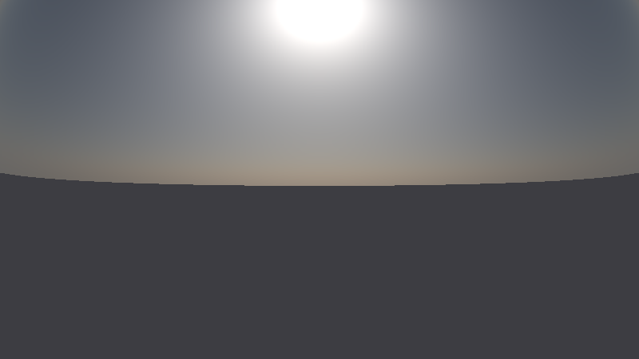
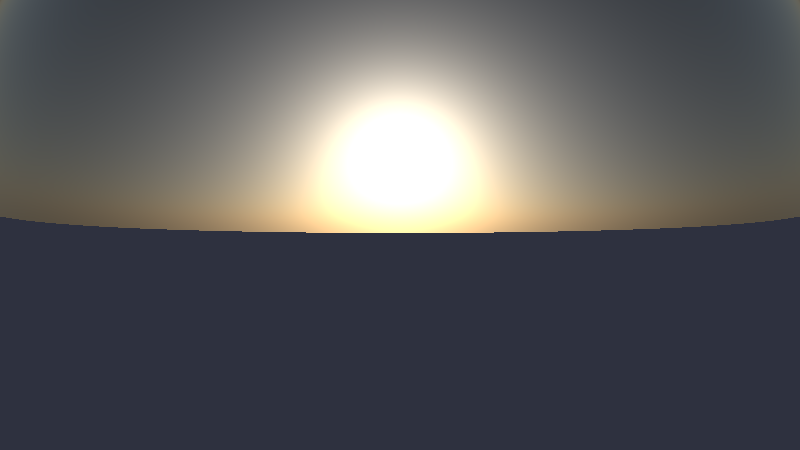
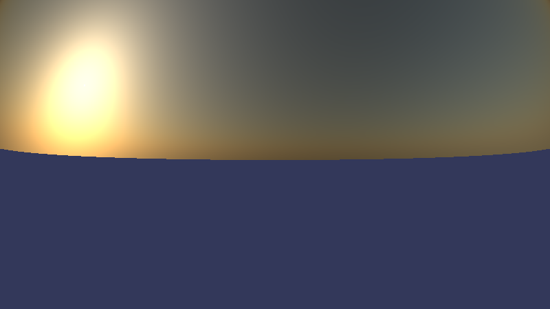

atmospheric-rendering-rs
===

This is an experimental project to render atmospheric scenes written in Rust.

Currently, it calculates only Rayleigh and aerosol components under plane-parallel approximation and single-scattering approximation.

This code is based on the non-public code used in the internal workshop in CAOS RCP group of Tohoku University. The original code was written in Fortran 90.

Usage
---

To compile,

    $ cargo build --release

Edit config.yaml and run the program.

    $ target/release/atmospheric-rendering-rs config.yaml

The result will be appear as `image.png`.

Examples
---

[examples/scene1/config.yaml](examples/scene1/config.yaml)

---

[examples/scene2/config.yaml](examples/scene2/config.yaml)

---

[examples/scene3/config.yaml](examples/scene3/config.yaml)

